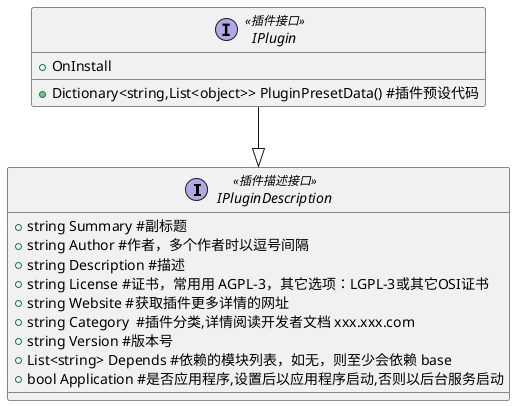

#目录
[TOC]

---

# 插件设计

**引言**

> 插件实体参阅 odoo 社区的一篇文章 从 0 `开始创建一个 Odoo 插件模`[^1]

## 1.插件的商店显示

- 插件在商店的显示信息应当是固定的,不能在程序中通过编程来动态变更.可以查看下载量,评论,评级
- 且应当有多种不同的方式编辑,或设置.例如 c#语言类,xml,json,html 静态语言的好处是智能语法提示和类型约束,json,xml 等配置文件的好处是不用编译整个项目,当插件配置参数过多而且需要调试插件的版本依赖等情况，插件易于调整
- 插件的资源的多平台性,例如移动端,小程序,Web 手机端,Pc 端等

### 1.1 图标显示

插件图标具备以下特点

- 跨平台跨设备
- 插件

## 2.插件的类图设计

[^1]: [从 0 开始创建一个 Odoo 插件模块](https://alanhou.org/create-odoo-addon-module/)
