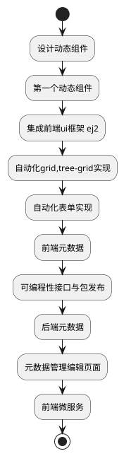

# 简介

> 文档源码: [https://github.com/24wings/website/](https://github.com/24wings/website/)
> 项目案例代码: [https://github.com/24wings/dynamic-front-samples](https://github.com/24wings/dynamic-front-samples)

 在日常工作中我们总是遇到一些普通需求,虽然简单,但是架不住业务的多和繁琐啊,而且细节都要比较完善。例如,需要增加一个表单,表单中有一些常用的字段,以及集联,下拉树选择框,当然不能错过表单校验,以及错误提醒。还有http请求，异常处理等等.
 
 而一个普通的CRUD管理页面就会花费我们不少的时间,虽然一顿操作猛如虎,代码量却着实不少,而且前后端的分工,导致后端难以维护前端代码.试着想象一下如果我们能够一一串简单的json表示完一整套CRUD页面,是否意味`常用性的CRUD`以及`常用性复杂页面` 能够轻松的表达出来.而后端则可以通过`特性(c# Attribute)`或`注解(Java Annotation)`,`装饰器(Nodejs Decorator)`来实现去前端化


如果你想极大程度消除管理端的前端的重复性工作,甚至消除前端的存在 该系列文章是一条实现的探索的思路。当然我们提供了一套全面的集成框架可以供你开箱使用[^emeschina.com]
就是提供实现动态组件编程实现上述效果的教程,文章的顺序如下




 
1. 从一个动态组件编程的思路开始[^design-dynamic-component]
2. 引导编写第一个自己的动态组件, 当我们做完案例后如下`json代码`即可表示一个简单的表单[^dynamic-component-start]

 ```json

 {
     "fields":[
         {"field":"name","type":"string","label":"名称","required":true},
         {"field":"age","type":"number","label":"年龄","required":true},
         {"field":"birthday","type":"datetime","label":"生日","required":true}
     ]
 }
 ```
 
3. 集成ej2框架并设计`动态组件auto-grid`的元数据,然后实现一个简单的CRUD的AutoGrid组件
4. 自动化grid,tree-grid实现;
5. 自动化表单实现;
6. 前端元数据,当实现前端元数据的之后,我们可以通过前端类来描述一套CRUD页面


```typescript
StatusTab ("无效", false, nameof (MenuDto.IsValid))
    StatusTab ("有效", true, nameof (MenuDto.IsValid))
    Tab (headerText = "系统信息", dataFromMain = true, type = typeof (SystemInfoDto))
    Display (Name = "菜单")
    AutoEditor (ShowDialog = false)
    DataSource (Url = "/Frameworks/Menu/Load", InsertUrl = "/Frameworks/Menu/Insert", UpdateUrl = "/Frameworks/Menu/Update", RemoveUrl = "/Frameworks/Menu/Remove")
    AutoTreeGrid (ViewMode = TreeViewMode.TreeGrid, TextMapping = "Name")
    export class MenuDto {
        public long Id { get; set; }
        /// <summary>
        /// 上级模块
        /// Desc:上级机构
        /// </summary>
        DisplayName ("上级菜单")
         ParentId:number;

        DisplayName ("菜单名称")
        Name :string;
        /// <summary>
        /// 菜单的区域名
        /// </summary>
       Area :string;
        /// <summary>
        /// 控制器名称
        /// </summary>
      Controller :string;
        /// <summary>
        /// Action名称
        /// </summary>
         Action :string
        /// <summary>
        /// 层级
        /// </summary>
       Level :number;
        /// <summary>
        /// 是否有下级
        /// </summary>
       HasChild :boolean;
        /// <summary>
        /// 排序号
        /// </summary>
        DisplayName ("排序号")
       SortNo :number;
        /// <summary>
        /// 路径
        /// </summary>
       Path :string;
        /// <summary>
        /// 分组编号
        /// </summary>
          GroupKey:number;
        /// <summary>
        /// 是否有效
        /// </summary>
          IsValid :bool
        /// <summary>
        /// 子节点集合
        /// </summary>
         Childs :MenuDto[]
    }

```


9. 后端集成元数据,利用反射集成类上的元数据,此时c#类即描述元数据
```csharp
 [StatusTab ("无效", false, nameof (MenuDto.IsValid))]
    [StatusTab ("有效", true, nameof (MenuDto.IsValid))]
    [Tab (headerText = "系统信息", dataFromMain = true, type = typeof (SystemInfoDto))]
    [Display (Name = "菜单")]
    [AutoEditor (ShowDialog = false)]
    [DataSource (Url = "/Frameworks/Menu/Load", InsertUrl = "/Frameworks/Menu/Insert", UpdateUrl = "/Frameworks/Menu/Update", RemoveUrl = "/Frameworks/Menu/Remove")]
    [AutoTreeGrid (ViewMode = TreeViewMode.TreeGrid, TextMapping = "Name")]
    public class MenuDto {
        public long Id { get; set; }
        /// <summary>
        /// 上级模块
        /// Desc:上级机构
        /// </summary>
        [DisplayName ("上级菜单")]
        public long ParentId { get; set; }

        [DisplayName ("菜单名称")]
        public string Name { get; set; }

        /// <summary>
        /// 菜单的区域名
        /// </summary>
        public string Area { get; set; }

        /// <summary>
        /// 控制器名称
        /// </summary>
        public string Controller { get; set; }

        /// <summary>
        /// Action名称
        /// </summary>
        public string Action { get; set; }

        /// <summary>
        /// 层级
        /// </summary>
        public int? Level { get; set; }

        /// <summary>
        /// 是否有下级
        /// </summary>
        public bool HasChild { get; set; }

        /// <summary>
        /// 排序号
        /// </summary>
        [DisplayName ("排序号")]
        public int SortNo { get; set; }

        /// <summary>
        /// 路径
        /// </summary>
        public string Path { get; set; }

       
        /// <summary>
        /// 分组编号
        /// </summary>
        public int GroupKey { get; set; }


        /// <summary>
        /// 是否有效
        /// </summary>
        public bool IsValid { get; set; }

        /// <summary>
        /// 子节点集合
        /// </summary>
        public ICollection<MenuDto> Childs { get; set; }
    }
```
11. 反射元数据模型类上的元数据,实现CRUD元数据模型管理页面


[^design-dynamic-component]: [设计动态组件](#docs/front/dynamic-component-program/design-dynamic-component)

[^dynamic-component-start]: [第一个动态组件](#docs/front/dynamic-component-program/design-dynamic-component)
[^emeschina.com]: [emeschina.com](http://emeschina.com)是一套快速开发框架,集成了前端angular,vue,react,blazor实现,后端dotnet core,spring boot,nodejs 等不同框架的实现